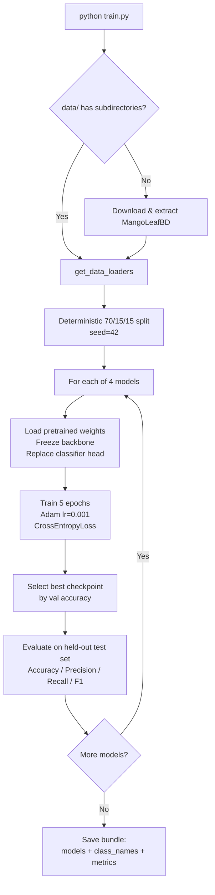
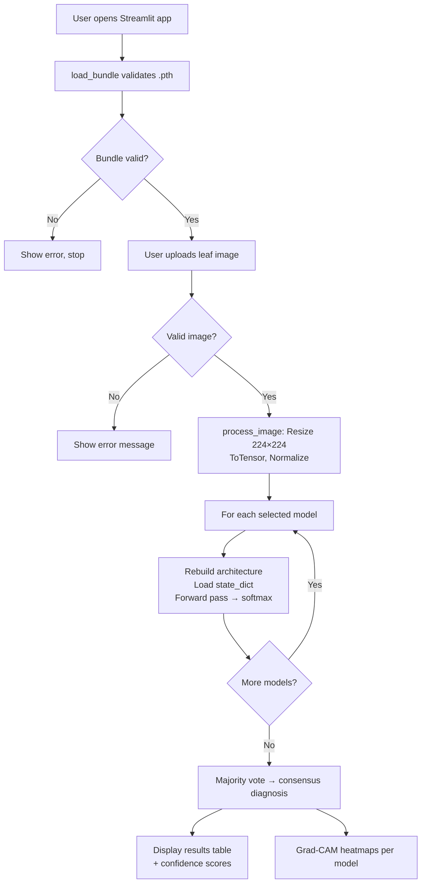

# 🥭 Mango Guard AI Lab

Multi-model mango leaf disease classification system with consensus diagnosis, Grad-CAM explainability, and an interactive Streamlit dashboard.

---

## Table of Contents

- [Project Overview](#project-overview)
- [Architecture Overview](#architecture-overview)
- [System Flow](#system-flow)
- [Dataset](#dataset)
- [Training Pipeline](#training-pipeline)
- [Inference Application](#inference-application)
- [Core Modules](#core-modules)
- [Data Model](#data-model)
- [Security Measures](#security-measures)
- [Setup & Installation](#setup--installation)
- [Quickstart](#quickstart)
- [Testing](#testing)
- [Project Structure](#project-structure)
- [Limitations](#limitations)

---

## Project Overview

This system trains four convolutional neural network classifiers on mango leaf images and serves them through a single interactive dashboard. A user uploads a leaf photograph, and the selected models each produce an independent prediction. A majority-vote consensus determines the final diagnosis, while Grad-CAM heatmaps show which regions of the leaf influenced each model's decision.

**Key capabilities (implemented in code):**

| Capability | Source |
|---|---|
| Multi-model transfer-learning training pipeline | `train.py` |
| Auto-download and extraction of MangoLeafBD dataset | `train.py → setup_data()` |
| Deterministic train / val / test split (seed 42) | `train.py → get_data_loaders()` |
| Held-out test set evaluation for final metrics | `train.py → _evaluate_loader_metrics()` |
| Streamlit dashboard with 4 interactive tabs | `app.py → main()` |
| Consensus diagnosis via majority vote | `app.py` — Tab 1 |
| Grad-CAM visual attention overlays per model | `app.py` — Tab 2 |
| Model leaderboard with radar chart comparison | `app.py` — Tab 3 |
| Dataset class distribution and sample browser | `app.py` — Tab 4 |
| Bundle schema validation on load | `app.py → load_bundle()` |

**Disease classes** (from the MangoLeafBD Dataset):

Anthracnose · Bacterial Canker · Cutting Weevil · Die Back · Gall Midge · Healthy · Powdery Mildew · Sooty Mould

---

## Architecture Overview

The system consists of two independent runtime entry points backed by a shared model bundle artifact.

```
┌──────────────┐      multi_model_bundle.pth      ┌──────────────────┐
│   train.py   │ ──────────  saves  ──────────▶   │     app.py       │
│  (training)  │                                   │  (inference UI)  │
└──────────────┘                                   └──────────────────┘
       │                                                    │
       ▼                                                    ▼
  MangoLeafBD Dataset                              Streamlit Dashboard
  (auto-downloaded)                               (browser at :8501)
```

| Component | File | Role |
|---|---|---|
| Training pipeline | `train.py` | Downloads data, trains 4 models, evaluates on held-out test set, saves bundle |
| Inference app | `app.py` | Loads bundle, serves multi-model inference, Grad-CAM, metrics, EDA |
| Model bundle | `multi_model_bundle.pth` | Single `.pth` file containing all state dicts, class names, and test metrics |
| Test suite | `tests/` | Unit, integration, and stress tests with pytest |

**Model architectures (all four trained and served):**

| Model | Base | Frozen Backbone | Trainable Head |
|---|---|---|---|
| EfficientNet-B0 | `torchvision.models.efficientnet_b0` | `.features` | `nn.Dropout(0.3) → nn.Linear` |
| ResNet18 | `torchvision.models.resnet18` | All params | `.fc = nn.Linear` |
| MobileNetV3-Large | `torchvision.models.mobilenet_v3_large` | `.features` | `.classifier[3] = nn.Linear` |
| DenseNet121 | `torchvision.models.densenet121` | `.features` | `.classifier = nn.Linear` |

All models use ImageNet-pretrained weights during training. Feature extraction (backbone) layers are frozen; only the classification head is fine-tuned.

---

## System Flow

### Training Flow



### Inference Flow



---

## Dataset

**Source:** [MangoLeafBD Dataset](https://data.mendeley.com/public-api/zip/hxsnvwty3r/download/1) (Mendeley Data)

| Property | Value |
|---|---|
| Classes | 8 (listed above) |
| Expected path after extraction | `data/MangoLeafBD Dataset/<class>/` |
| Image format | JPEG |
| Auto-download trigger | `data/` missing or containing no subdirectories |

The dataset is automatically downloaded and extracted on the first run of `train.py`. A path-traversal guard (`safe_extract_zip`) validates every archive member before extraction.

---

## Training Pipeline

All training logic resides in `train.py`.

### Configuration

| Parameter | Value | Source |
|---|---|---|
| `DATASET_URL` | Mendeley public API zip endpoint | `train.py:15` |
| `DATA_DIR` | `data` | `train.py:16` |
| `IMG_SIZE` | 224 | `train.py:17` |
| `BATCH_SIZE` | 32 | `train.py:18` |
| `EPOCHS` | 5 | `train.py:19` |
| `BUNDLE_PATH` | `multi_model_bundle.pth` | `train.py:20` |
| `DEVICE` | CUDA if available, else CPU | `train.py:21` |
| `SEED` | 42 | `train.py:22` |

### Data Split

Images are loaded with `torchvision.datasets.ImageFolder`. A seeded permutation (`torch.randperm` with `generator.manual_seed(42)`) produces index sets for a 70 / 15 / 15 train / val / test split. Separate `ImageFolder` instances are created for train and val/test to apply different transforms:

| Split | Transform | Augmentation |
|---|---|---|
| Train | Resize 224×224, `RandomHorizontalFlip`, `RandomRotation(15)`, ToTensor, Normalize | Yes |
| Val / Test | Resize 224×224, ToTensor, Normalize | No |

Normalization uses ImageNet channel statistics: mean `(0.485, 0.456, 0.406)`, std `(0.229, 0.224, 0.225)`.

### Training Loop

For each of the four models:

1. Load ImageNet-pretrained weights and freeze backbone parameters.
2. Replace the classification head to output `num_classes` logits.
3. Train with `Adam(lr=0.001)` on `CrossEntropyLoss`, optimizing only `requires_grad=True` parameters.
4. After each epoch, evaluate on the validation set. Retain the checkpoint with the highest validation accuracy.
5. After training completes, restore best weights and evaluate on the **held-out test set** using `_evaluate_loader_metrics()` to produce final Accuracy, Precision (macro), Recall (macro), and F1-Score (macro).

### Output

A single file `multi_model_bundle.pth` is saved via `torch.save` containing a `dict` with keys `models`, `class_names`, and `metrics`.

---

## Inference Application

All UI logic resides in `app.py`, built with Streamlit.

### Tab 1 — Consensus Diagnosis

- User uploads a `jpg`, `png`, or `jpeg` image via the sidebar.
- Invalid or corrupt files are caught (`UnidentifiedImageError`, `OSError`, `ValueError`) and reported.
- The image is preprocessed: resized to 224×224, converted to tensor, normalized with the same ImageNet statistics as training.
- Each selected model reconstructs its architecture (with `weights=None`), loads its state dict from the bundle, and runs a forward pass under `torch.no_grad()`.
- Softmax probabilities are computed; the class with highest probability is the model's prediction.
- The consensus is determined by `pandas.DataFrame.mode()` — the most frequent prediction across all selected models. Vote count and per-model confidence are displayed.

### Tab 2 — Explainability (Grad-CAM)

- For each selected model, Grad-CAM is computed using `pytorch_grad_cam.GradCAM` targeting architecture-specific layers:
  - EfficientNet-B0: `model.features[-1]`
  - ResNet18: `model.layer4[-1]`
  - MobileNetV3-Large: `model.features[-1]`
  - DenseNet121: `model.features.denseblock4.denselayer16`
- The heatmap is overlaid on the resized input image using `show_cam_on_image`.
- Errors during Grad-CAM generation are caught and displayed per-model without crashing the app.

### Tab 3 — Performance Lab

- Displays a leaderboard table of all models and their test-set metrics (Accuracy, Precision, Recall, F1-Score) from the bundle, with the best value in each column highlighted.
- A Plotly radar chart compares selected models across all four metrics.

### Tab 4 — Dataset EDA

- If the dataset folder `data/MangoLeafBD Dataset` is present, displays a bar chart of images per class and a per-class sample image browser (first 4 images).
- If the folder is absent, an informational message is shown.

---

## Core Modules

### `train.py`

| Function | Purpose | Input | Output |
|---|---|---|---|
| `safe_extract_zip(zip_file, target_dir)` | Validates archive paths to prevent traversal attacks, then extracts | `ZipFile`, directory path | Files on disk (or raises `ValueError`) |
| `setup_data()` | Downloads and extracts dataset if not present; cleans up on failure | — | Files in `data/` |
| `get_data_loaders()` | Builds seeded train/val/test `DataLoader` objects with proper transforms | — | `(train_loader, val_loader, test_loader, class_names)` |
| `get_model(model_name, num_classes)` | Constructs pretrained model with frozen backbone and new head | Model name string, int | `model` on `DEVICE` |
| `_evaluate_loader_metrics(model, data_loader)` | Computes Accuracy, Precision, Recall, F1 on a given loader | Model, DataLoader | `dict` with four float values |
| `train_one_model(model_name, model, train_loader, val_loader)` | Runs training loop, tracks best val accuracy, returns best weights | Name, model, two loaders | `(state_dict, best_metrics)` |
| `main()` | Orchestrates full pipeline: data → train → evaluate → save | — | `multi_model_bundle.pth` on disk |

### `app.py`

| Function | Purpose | Input | Output |
|---|---|---|---|
| `get_model(model_name, num_classes)` | Rebuilds architecture (no pretrained weights) with Grad-CAM target layer | Model name string, int | `(model, target_layer)` |
| `load_bundle()` | Loads and validates `.pth` bundle; cached with `@st.cache_resource` | — | `dict` or `None` |
| `process_image(image)` | Applies inference transforms to a PIL image | `PIL.Image` | Tensor `(1, 3, 224, 224)` |
| `main()` | Renders the 4-tab Streamlit dashboard | — | UI |

---

## Data Model

### Bundle Schema (`multi_model_bundle.pth`)

The bundle is a Python `dict` serialized with `torch.save` and loaded with `torch.load(weights_only=True)`.

```python
{
    "models": {
        "EfficientNet-B0": OrderedDict,   # state_dict
        "ResNet18": OrderedDict,
        "MobileNetV3-Large": OrderedDict,
        "DenseNet121": OrderedDict,
    },
    "class_names": ["Anthracnose", "Bacterial Canker", ...],  # list[str]
    "metrics": {
        "EfficientNet-B0": {
            "Accuracy": float,
            "Precision": float,
            "Recall": float,
            "F1-Score": float,
        },
        # ... same structure for each model
    },
}
```

**Validation on load** (`app.py → load_bundle()`):
- File existence check
- `torch.load` with `weights_only=True`
- Top-level keys must be `{models, class_names, metrics}`
- `class_names` must be a non-empty `list`
- `models` must be a `dict`
- `metrics` must be a `dict`

---

## Security Measures

| Measure | Location | Description |
|---|---|---|
| Safe archive extraction | `train.py → safe_extract_zip()` | Every zip member path is resolved to an absolute path and validated against the target directory to prevent path-traversal attacks |
| Safe model deserialization | `app.py:67` | `torch.load(..., weights_only=True)` restricts deserialization to tensor data only, preventing arbitrary code execution from untrusted `.pth` files |
| Bundle schema validation | `app.py → load_bundle()` | Validates key existence and type checks before accessing bundle contents |
| Upload validation | `app.py:128–131` | Image uploads are opened with `PIL.Image.open` inside a try/except catching `UnidentifiedImageError`, `OSError`, and `ValueError` |
| Download timeout | `train.py:48` | Dataset download uses `timeout=60` to prevent indefinite hangs |
| Failed download cleanup | `train.py:57–61` | If download/extraction fails, the partially-created `data/` directory is removed via `shutil.rmtree` before re-raising |

---

## Setup & Installation

### Prerequisites

- Python 3.10+
- (Optional) NVIDIA GPU with CUDA for accelerated training and inference

### Steps

```bash
# Clone repository
git clone https://github.com/<your-username>/Mango-Leaf-Disease-Prediction.git
cd Mango-Leaf-Disease-Prediction

# Create virtual environment
python -m venv .venv

# Activate (Windows)
.venv\Scripts\activate

# Activate (Linux/macOS)
source .venv/bin/activate

# Install dependencies
pip install -r requirements.txt
```

The `requirements.txt` references `--extra-index-url https://download.pytorch.org/whl/cu130` for CUDA 13.0 PyTorch builds. On CPU-only machines, PyTorch will install and run without CUDA support automatically.

---

## Quickstart

### 1. Train models

```bash
python train.py
```

On first run, the MangoLeafBD dataset (~240 MB) is downloaded and extracted into `data/`. Training runs all four models sequentially for 5 epochs each and saves `multi_model_bundle.pth`.

### 2. Launch the dashboard

```bash
streamlit run app.py
```

Open the URL shown in the terminal (default `http://localhost:8501`). Upload a mango leaf image via the sidebar, select models, and navigate the tabs.

### 3. Run tests

```bash
python -m pytest tests/ -v
```

### 4. Run stress scenarios

```bash
python tests/phase4_stress_runner.py
```

---

## Testing

| Suite | File | Framework | Tests |
|---|---|---|---|
| App unit + ML tests | `tests/test_app_unit_ml.py` | pytest | 10 (4 parametrized + 6) |
| Train unit + integration tests | `tests/test_train_unit_integration.py` | pytest | 7 |
| Stress scenarios | `tests/phase4_stress_runner.py` | Standalone runner | 13 scenarios |
| Test configuration | `tests/conftest.py` | pytest fixtures | Session-scoped stubs |

### Test categories

**App tests** cover: model factory output shapes for all 4 architectures, unknown model rejection, image preprocessing tensor shape and dtype, `None` input handling, missing bundle file, corrupted bundle file, and end-to-end inference from a saved bundle.

**Train tests** cover: dataset download skip when data exists, download failure cleanup, data loader tensor shapes and splits, unknown architecture rejection, training loop contract (returns state dict + metrics), empty validation loader handling, and full `main()` orchestration with bundle save verification.

**Stress scenarios** cover: 8192×8192 image processing, 30 repeated inference calls, 10 rapid UI interactions, CSV/video upload rejection, 64-image batch processing, CPU/GPU device switching, missing model file, corrupted model file, wrong dataset schema, null metadata, and large synthetic dataset loading.

**Test stubs** (`conftest.py`): Session-scoped fixtures replace `streamlit`, `plotly`, `pytorch_grad_cam`, and `cv2` with lightweight dummy modules to enable headless test execution without UI dependencies.

### Latest results

```
tests/  — 17 passed, 0 failed
stress  — 13 passed, 0 failed
```

---

## Project Structure

```
.
├── app.py                          # Streamlit inference dashboard
├── train.py                        # Multi-model training pipeline
├── requirements.txt                # Python dependencies
├── multi_model_bundle.pth          # Saved model bundle (generated by train.py)
├── README.md
├── TEST_REPORT.md                  # Audit and test evidence report
├── LICENSE
├── tests/
│   ├── conftest.py                 # Session-scoped test stubs
│   ├── test_app_unit_ml.py         # App unit + ML tests
│   ├── test_train_unit_integration.py  # Train unit + integration tests
│   └── phase4_stress_runner.py     # Stress scenario harness
├── data/
│   └── MangoLeafBD Dataset/        # Auto-downloaded dataset
│       ├── Anthracnose/
│       ├── Bacterial Canker/
│       ├── Cutting Weevil/
│       ├── Die Back/
│       ├── Gall Midge/
│       ├── Healthy/
│       ├── Powdery Mildew/
│       └── Sooty Mould/
├── uploads/                        # (unused in current runtime)
├── Mango_Leaf_Disease_Prediction.ipynb  # Legacy notebook (not used by pipeline)
├── mango_leaf_disease_model.h5     # Legacy artifact (not used)
└── mango_model.pth                 # Legacy artifact (not used)
```

---

## Limitations

| Limitation | Detail |
|---|---|
| Models rebuilt per request | Each inference call in `app.py` reconstructs the model architecture and loads state dict; no in-memory model caching across requests |
| Single-image inference only | The Streamlit UI processes one uploaded image at a time; no batch upload |
| Fixed 5 epochs | Training runs a fixed `EPOCHS = 5`; no early stopping or learning rate scheduling is implemented |
| No class imbalance handling | Training uses standard `CrossEntropyLoss` without class weights or oversampling |
| Dataset is downloaded in-memory | `requests.get` loads the full zip into memory before extraction; large datasets may cause memory pressure |
| Hardcoded dataset URL | The Mendeley download URL is a constant; if the upstream endpoint changes, `setup_data()` will fail |
| Radar chart axis range | The Plotly radar chart uses a fixed radial range of `[0.9, 1.0]`, which may clip metrics below 0.9 |
| EDA tab requires local dataset | Tab 4 depends on `data/MangoLeafBD Dataset/` being present on disk; it does not function from the bundle alone |
| Legacy artifacts not cleaned | `mango_leaf_disease_model.h5`, `mango_model.pth`, and the `.ipynb` notebook remain in the repository but are unused by the active pipeline |
